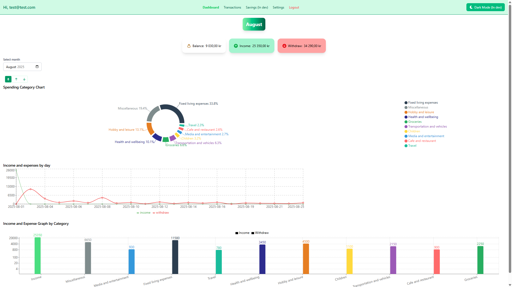
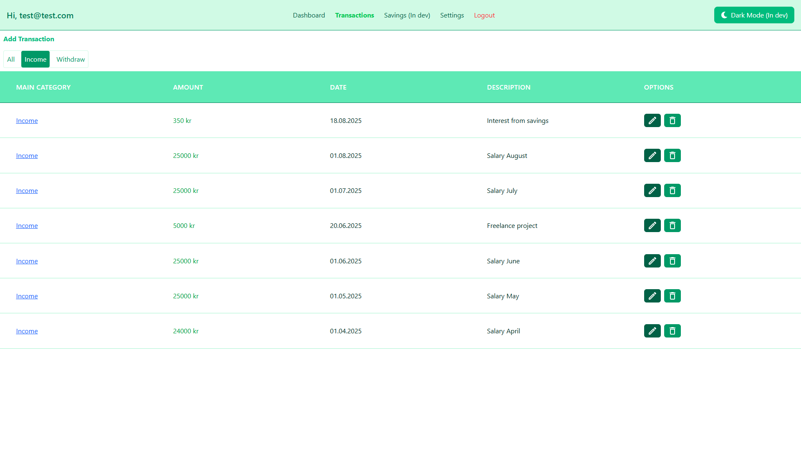
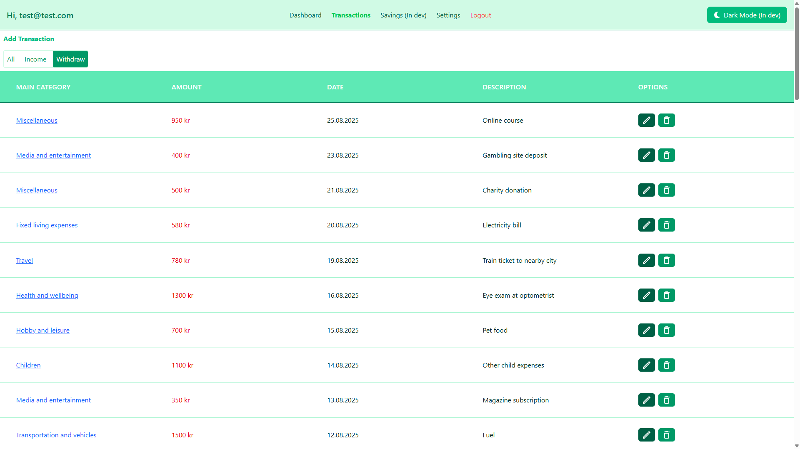

# 💰 Budget Allright

A personal finance tracking application built with **React**, **Vite**, and **Supabase**. This app allows users to manage transactions, view dashboards, and track savings (feature in development).

🌍 [Live Demo](https://budget-allright.netlify.app/) | 📂 [Repo](https://github.com/Zmax-17/budget-allright)

---

## ✨ Features

- 🔐 **User Authentication** (Supabase Auth)
- ➕ **Transaction Management** (Add, Edit, Delete)
- 📊 **Dashboard** with charts and balance overview
- 📂 **Categories & Subcategories** (with drill-down)
- 📅 **Date Filter** with calendar/month picker
- 🌗 **Dark/Light Theme Toggle**
- 🎨 **Responsive UI** powered by Tailwind CSS

---

## 🛠️ Tech Stack

### 💻 Frontend

- ⚛️ **React**
- ⚡ **Vite**
- 🎨 **Tailwind CSS**
- 📈 **Recharts**
- 🔄 **React Query**
- 🌍 **React Context** (state management)

### 🧰 Supporting Libraries

- 📅 **date-fns** – date utilities
- 🧾 **react-hook-form** – form handling
- 🔔 **react-hot-toast** – toast notifications
- 🧩 **react-icons** – icons library
- 📈 **Recharts** – charts and graphs

### 🔧 Backend

- 🗄️ **Supabase** (PostgreSQL + Auth + API)

### ⚙️ DevOps

- 🚀 **Netlify** – deployment
- 🧹 **ESLint + Prettier** – code formatting and linting

---

## 📸 Screenshots

### Dashboard

_(Add screenshot with balance and charts here)_



### Transactions List

_(Add screenshot showing transactions and categories here)_




---

## 📌 Roadmap

- [x] Categories & Subcategories
- [x] Transaction CRUD
- [x] Date filter
- [x] Income/Expense color coding
- [] Dark mode
- [] Savings tracker (in development)

---

## 🚀 Getting Started

### 1. Clone the repository:

```bash
git clone https://github.com/Zmax-17/budget-allright
```

### 2. Install dependencies

      npm install

### 3. Set up environment variables (.env):

      VITE_SUPABASE_URL=your-supabase-url
      VITE_SUPABASE_ANON_KEY=your-supabase-anon-key

### 4. Run the app:

      bash
      npm run dev -->

### 5. Demo Account

To quickly try out the app without signing up, use the demo account:

**Email:** `demo@budgetallright.com`  
**Password:** `demo123`

Demo data uploading is also available in the app settings.
